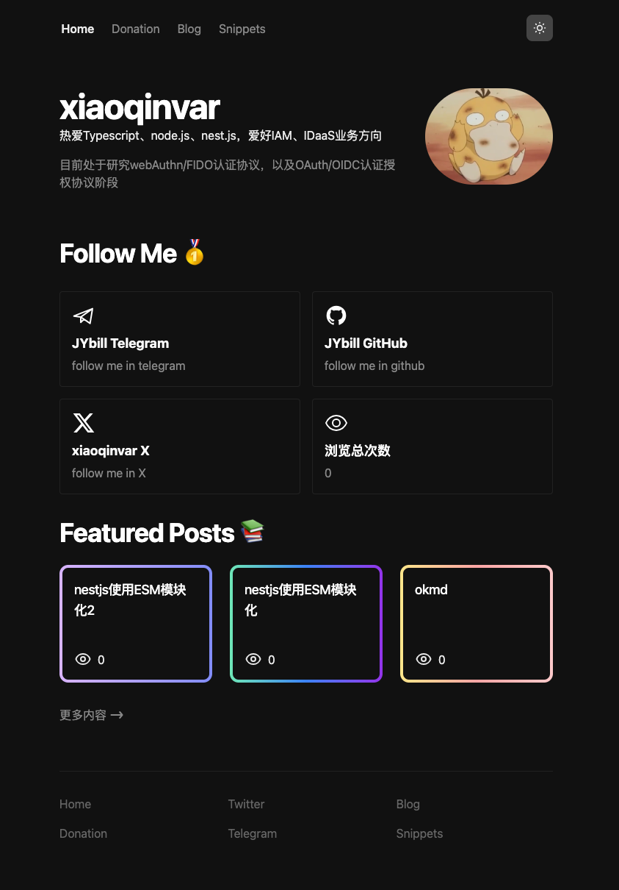

# Origin Author
- [0xDedinfosec Blogs](https://github.com/0xdedinfosec/0xdedinfosec-astro)
> 本项目基于该作者的项目将代码进行重构、组建抽离，并增加了一些额外的特效等功能

# xiaoqinvar Blogs 🔥

- technology：astro、tailwindcss、typescript、react、gsap.js...

# 项目配置文件
- src/config/index.tsx（内有注释）

# License

Licensed under the [MIT license](LICENSE.md).
